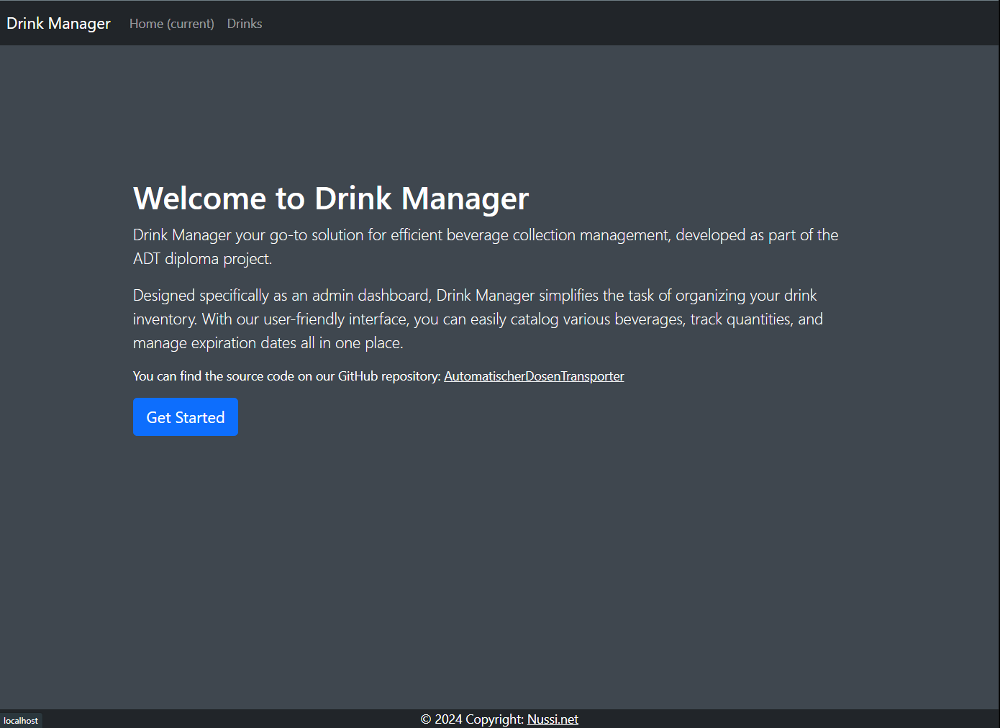
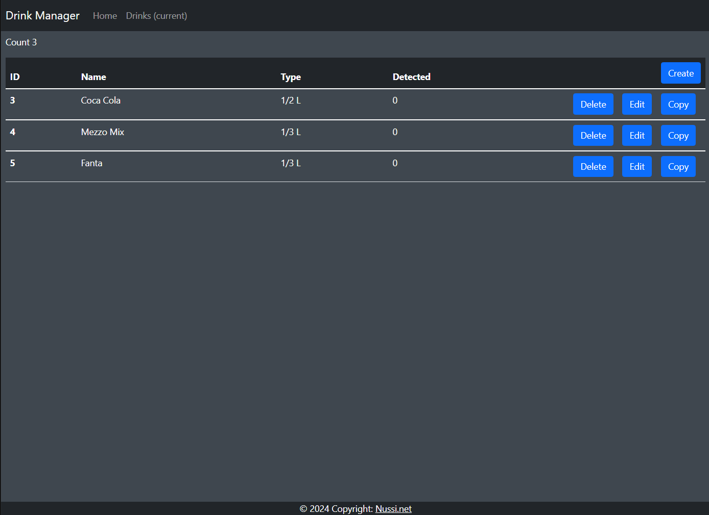

# Drink Manger
[](https://github.com/AutomatischerDosenTransporter/DrinkManager/actions/workflows/ci.yml)

### Visit [https://drink.nussi.net]()

---
## How to host?

### Prerequisites:
- Docker Engine
- Docker Compose

### Steps:
1. **Clone the Repository:**
    ```bash
    git clone https://github.com/AutomatischerDosenTransporter/DrinkManager
    cd DrinkManager
    ```
   
2. **Build and Run the Application:**
    ```bash
    docker-compose up -d
    ```

3. **Access Drink Manager:**
    - Once the containers are up and running, you can access Drink Manager by visiting `http://localhost` in your web browser.

4. **Stopping the Application:**
    - To stop the application and remove containers, run:
        ```bash
        docker-compose down
        ```
      
5. **Additional Configuration:**
    - For additional configuration options, refer to the `docker-compose.yml` file and modify it according to your requirements.

---
## Screenshots



